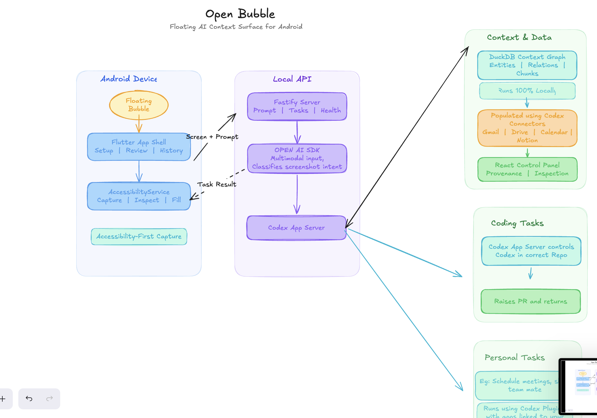
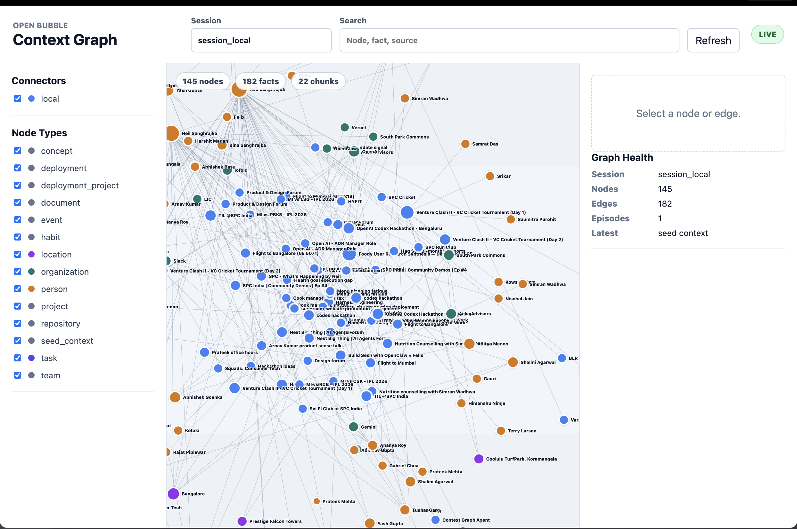
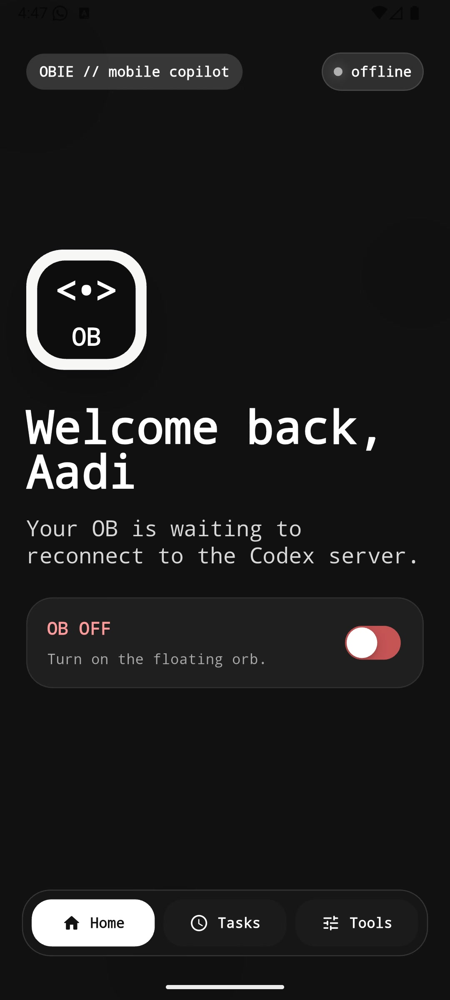
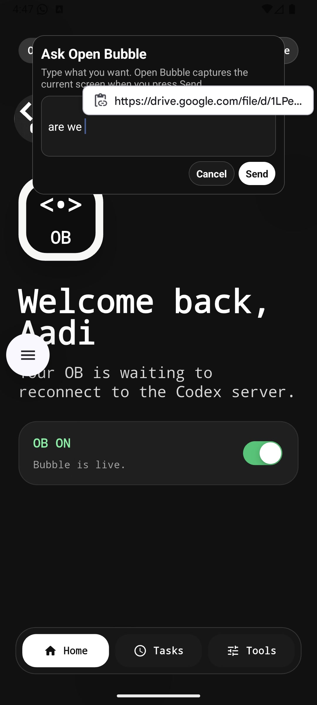
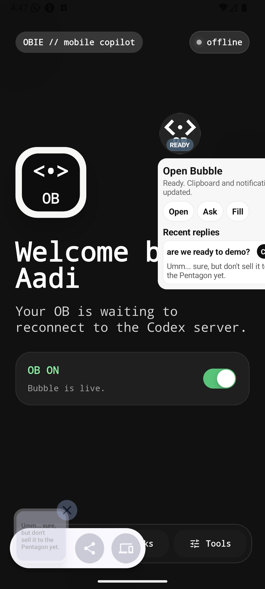
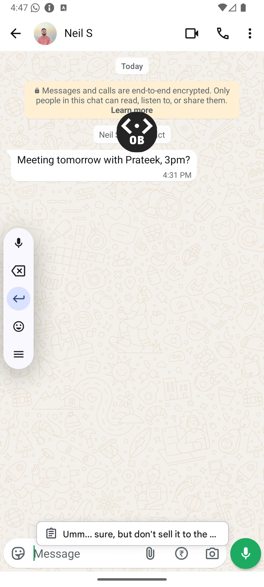
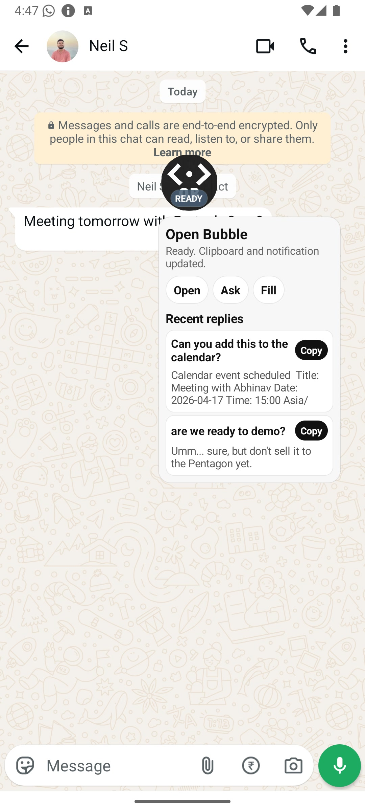
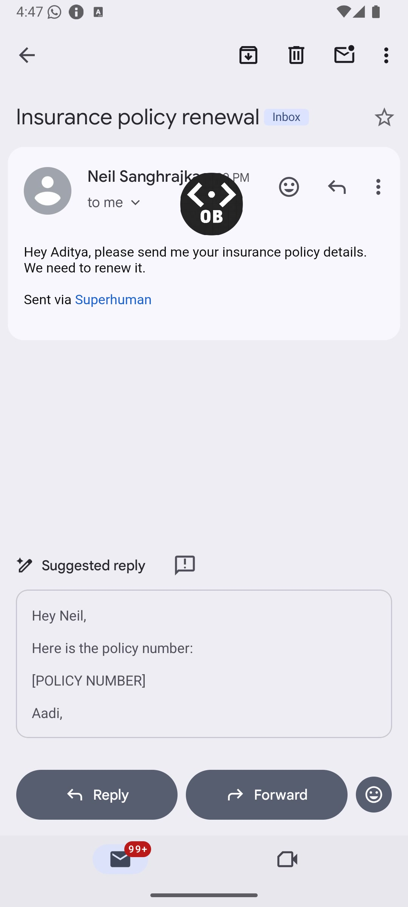
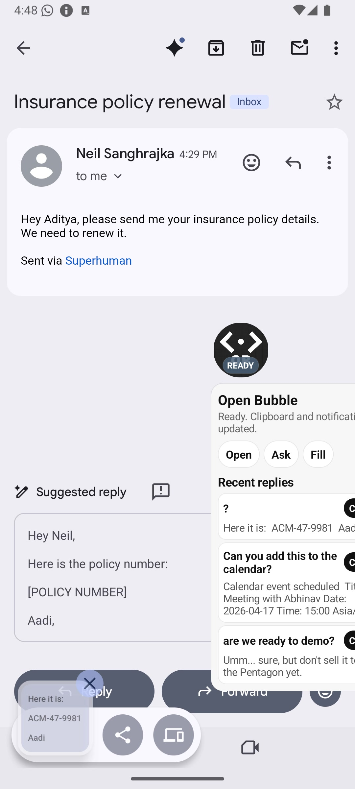
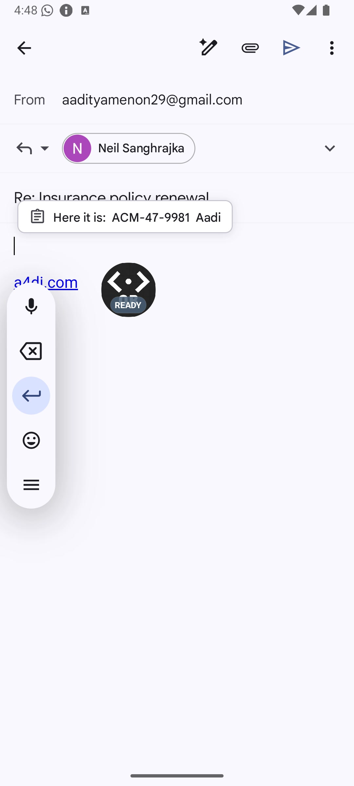

# Open Bubble



[How it works](https://drive.google.com/open?id=1UVTDksdpVVv0iuyxN8PCrqLKsE0GJWVY&usp=drive_fs)

Open Bubble is a hackathon prototype for a Flutter-first Android companion, a tiny local API, and a local Codex-agent workspace. The current MVP keeps the backend surface small while the Android client uses an accessibility-powered bubble to inspect the active screen, capture context, submit prompts, and surface replies back into the phone workflow.

## Demo

Open Bubble starts with OB confirming it is demo-ready by checking the live repository through the Codex server and verifying the latest build status.
Next, in WhatsApp, OB understands that a message refers to next week’s meeting, connects to Gmail and Calendar through the backend, creates the event, and returns the event ID.
Finally, when an email asks for an insurance policy number, OB retrieves it from memory.md, copies the answer to the clipboard, and prepares it to paste directly into the reply.

OB is an always-on mobile overlay assistant that floats across any Android app. It reads what's on screen, responds intelligently, and automates cross-app workflows — all without leaving the active app.

<p align="center">
  
  
  
</p>
<p align="center"><em>Activate OB → type a query → get an instant response in the floating bubble</em></p>

<p align="center">
  
  
</p>
<p align="center"><em>OB reads a WhatsApp message and creates a calendar event from context</em></p>

<p align="center">
  
  
  
</p>
<p align="center"><em>OB extracts an insurance policy number from Gmail and pastes it into a reply</em></p>

## MVP

- `apps/api` owns the local Fastify API.
- `GET /health` checks that the server is up.
- `POST /prompt` accepts one required `screenMedia` upload plus at least one of `promptText` or raw `promptAudio`, then creates a lightweight async task.
- `GET /tasks/:taskId` lets the client poll task state and fetch the result later.
- Completed prompt tasks now include a structured request classification plus a routing payload for later app-specific handling.
- Coding classifications also record a default local fallback workspace under repo-root `tmp/` for a future execution handoff.
- The frontend forwards raw audio without client-side transcription.
- The API returns a task handle immediately instead of blocking for the final result.

## One-command API tunnel

Run `./scripts/start-api-ngrok.sh` from the repo root to start the API and publish it through `ngrok`.

- The command prints the public URL.
- It syncs that URL into the repo-level `.env` as `OPEN_BUBBLE_API_BASE_URL`.
- Frontend setup details live in `docs/guides/frontend-api-server.md`.

## Codex Agent Context Graph

`apps/codex-agent` contains the local Codex-agent workspace for context graph experiments:

- screenshot + prompt request ingestion,
- DuckDB graph fixtures,
- Gmail/Drive/Calendar MCP result normalization,
- graph export JSON,
- a static local graph control panel.

This workspace is intentionally decoupled from `apps/api` dispatch. The API can call the scripts later through file/JSON handoffs.

## Repository shape

```text
open-bubble/
  apps/
    api/             # Fastify API MVP and local docs
    mobile/          # Flutter Android app
    codex-agent/     # Codex-agent context graph workspace
  docs/
    api/             # OpenAPI contract and examples
    guides/          # Frontend / local workflow guides
    specs/           # Short MVP notes
    adr/             # Architecture decision records
  .github/           # PR template / collaboration hygiene
```

## Working notes

- Read `AGENTS.md` before starting work.
- Keep API changes in sync with `docs/api/openapi.yaml`.
- Keep the docs short and remove outdated detail instead of layering on new active scope.
- Read `docs/specs/mcp-connectors.md` before changing Gmail/Drive/Calendar connector behavior.
- Read `docs/specs/graph-control-panel.md` before changing the graph inspection UI.
- Read `docs/specs/product-scope.md` for MVP boundaries.
- Read `docs/specs/team-collaboration.md` for workstream ownership.
- Log architectural decisions in `docs/adr/`.
